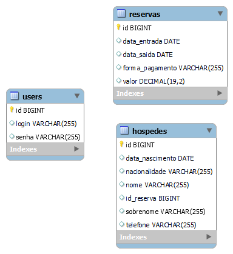

# Challenge ONE | Java | Back-end | Hotel Alura

<p align="center" >
     

</p>

---

## 🖥️ Tecnologias Utilizadas:

- Java
- Eclipse
- Intellij
- Maven
- MySql
- Hibernate
- Biblioteca JCalendar
- Lombok
- Plugin WindowBuilder 
</br>

---

## ⬇️ Download

### Como fazer o download: 

#### 🔹 Fork
1 - Faça o <strong>fork</strong> do projeto. No lado superior direito, ao clicar no ícone ele criará um repositório do projeto em sua conta pessoal do GitHub. </br>

<p align="center" >
     
</p></br>

2 - Após ter o repositório "forkado" para sua conta, verifica se a url da página é a do repositório da sua conta.

<p align="center" >
     
</p></br>

3 - Clique na opção <strong>Code</strong>. Ele apresentará três formas para instalar o repositório em sua máquina, e destacamos duas:

<p align="center" >
     
</p></br>

#### 🔹 Clonar ou baixar o ZIP

1 - Para clonar, basta copiar a <em>url</em> destacada na imagem e localizada logo abaixo do HTTPS, criar uma pasta em seu computador, abrir o <em>cmd</em> ou o <em>git bash</em> dentro dessa pasta e em seguida insira o comando <strong>git clone</strong> e com o botão direito do mouse dentro do terminal clicar na opção <strong>Paste</strong> para colar a <em>url</em> e dar <em>Enter</em>. 

<p align="center" >
     
</p></br>

2 - A segunda opção é baixar o código em um pacote <strong>"zipado"</strong> e extrair a pasta para o seu computador. 
</br></br>


## 🚧 Projeto

<p>Ao clonar ou baixar o projeto, abra ele usando o Intellij ou o eclipse e baixe as dependências do projeto usando o arquivo pom.xml</p>

<p>Depois de ter feito o download das dependências do projeto, você terá que criar na pasta src/main/resources 
uma pasta chamada "META-INF" e nessa pasta um arquivo "persistence.xml"</p>

<p>Esse arquivo deve ter as seguintes propriedades</p>

### XML basico esperado para o persistence.xml:

```xml
<?xml version="1.0" encoding="UTF-8"?>
<persistence xmlns="http://xmlns.jcp.org/xml/ns/persistence"
             xmlns:xsi="http://www.w3.org/2001/XMLSchema-instance"
             xsi:schemaLocation="http://xmlns.jcp.org/xml/ns/persistence http://xmlns.jcp.org/xml/ns/persistence/persistence_2_2.xsd"
             version="2.2">

    <persistence-unit name="<NOME_DO_PERSISTENCE_UNIT>" transaction-type="RESOURCE_LOCAL">
        <properties>
            <property name="javax.persistence.jdbc.driver" value="com.mysql.cj.jdbc.Driver"/>
            <property name="javax.persistence.jdbc.url" value="<URL>"/>
            <property name="javax.persistence.jdbc.user" value="<USER_NAME>"/>
            <property name="javax.persistence.jdbc.password" value="<USER_PASSWORD>"/>

            <property name="hibernate.dialect" value="org.hibernate.dialect.MySQL8Dialect"/>
            <property name="hibernate.hbm2ddl.auto" value="update"/>
            <property name="hibernate.show_sql" value="true"/> <!-- Opicional -->
            <property name="hibernate.format_sql" value="true"/> <!-- Opicional -->
            <property name="hibernate.temp.use_jdbc_metadata_defaults" value="false"/>
        </properties>
    </persistence-unit>
</persistence>
```

- <strong>NOME_DO_PERSISTENCE_UNIT</strong> - aqui vem o nome do persistence unit, geralmente recebe o mesmo nome do banco de dados.
  - <em>OBS: Uma variável de ambiente com o nome <strong>"UNIT_NAME"</strong> deve ser criada e o <u>valor dela deve ser o mesmo que essa propriedade</u>,
  ou seja, deve ter o valor igual ao nome escrito nesse arquivo.</em>
- <strong>URL</strong> - url jdbc do banco de dados MySQL com o nome do banco de dados, exemplo: jdbc:mysql://< HOST >:< PORT >/< DATABASE_NAME >
- <strong>USER_NAME</strong> - nome do usuário do banco de dados MySQL.
- <strong>USER_PASSWORD</strong> - senha do usuário do banco de dados MySQL.


## 📊 Banco de Dados

### Modelagem das tabelas:

<p align="center" >
     

[//]: # (https://user-images.githubusercontent.com/101413385/169434993-1d494d38-d122-457d-b973-52b42270114b.png)
    
</p></br>

## 🗔 Plugin WindowBuilder

No menu do <strong>Eclipse</strong>, vá até a aba <em>Help</em> e selecione a opção <em>Eclipse Marketplace</em>.

<p align="center" >
     
</p>

Na barra de pesquisa, insira <strong>window builder</strong> e clique em <em>Go</em>. Após a busca, selecione a primeira opção e clique em <em>Install</em>.

<p align="center" >
     
</p>

Na próxima janela, selecione o botão <em>Confirm</em>.

<p align="center" >
     
</p>

Clique na opção para aceitar os Termos de Uso, e para concluir clique em <em>Finish</em>.

<p align="center" >
     
</p>